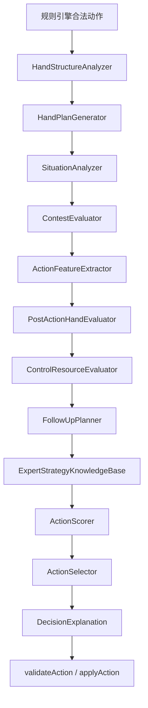

# Guandan Expert Bot Design Specification

> 历史归档：该 P2.5 expert 设计已于 2026-07-22 撤销，不再是当前产品实现依据。
> 当前唯一产品策略为 normal-vNext；恢复本规范须遵循 ADR-0024。
## 掼蛋专家启发式机器人设计规范 v1.0


> 项目：Card Game Platform  
> 文档定位：机器人系统长期设计规范  
> 当前实施阶段：P2.5 Expert Heuristic Bot  
> 目标水平：熟练玩家至中高级玩家  
> 约束：不接入大模型、不读取隐藏手牌、不依赖云端推理  
> 状态：Design Baseline v1.0

---

# 1. 文档目的

本文定义 Card Game Platform 中掼蛋专家启发式机器人的总体架构、决策流程、数据契约、策略知识库、评分体系、测试方法、性能要求和演进路线。

本文不是掼蛋规则说明。所有合法性判断仍以冻结后的规则文档和规则引擎为准。本文只负责回答：

- 在多个合法动作中，机器人如何选择更合理的动作；
- 如何使用公开记牌、玩家余牌数和牌型历史；
- 如何避免明显不合理的组牌、拆牌和资源消耗；
- 如何将人类专家经验转化为可解释、可测试、可维护的程序；
- 如何为未来拖拉机80分及其他扑克游戏复用机器人公共架构。

---

# 2. 设计目标

## 2.1 主要目标

P2.5 的机器人应做到：

1. 不做明显违反人类牌感的组牌；
2. 不机械地“能压就压”；
3. 不无意义拆炸弹、顺子、钢板、三连对；
4. 合理使用红桃级牌逢人配；
5. 保留必要控制牌和回收牌；
6. 评估动作后的整体手牌质量；
7. 使用公开记牌信息调整动作风险；
8. 根据开局、中局、尾局改变权重；
9. 考虑队友与对手的余牌和出牌倾向；
10. 输出可解释的候选动作评分。

## 2.2 非目标

P2.5 不做：

- 深度强化学习；
- 蒙特卡洛树搜索；
- 隐藏手牌采样；
- 在线大模型决策；
- 云端推理；
- 读取服务器中的对手真实手牌；
- 穷举整局最优解；
- 修改已冻结的掼蛋合法规则；
- 用策略模块绕过 `validateAction` 和 `applyAction`。

---

# 3. 当前问题基线

当前机器人存在以下典型问题：

## 3.1 逢人配低价值使用

示例：

```text
桌面：对5
手牌：JJ、QQ、红桃级牌、单6
错误：红桃级牌 + 6 组成对6
合理：使用自然对J，保留逢人配
```

## 3.2 有自然炸弹却制造更小炸弹

```text
手牌：8888、55、两张红桃级牌
错误：红桃级牌 + 红桃级牌 + 55 组成5555
合理：保留逢人配，优先保留或使用天然8888
```

## 3.3 无意义拆炸

```text
桌面：单5
手牌：8888及其他牌
错误：从8888中拆出一张8压单5
合理：过牌，或使用不破坏结构的散牌
```

## 3.4 控制牌耗尽

机器人连续打出王、级牌、A和高对子，最后留下大量2—7低散单，失去回收牌权能力。

## 3.5 公开记牌未进入决策

系统虽然记录：

- 已出牌；
- 出牌者；
- 牌型历史；
- 过牌历史；
- 各家余牌；

但当前评分器没有充分使用这些信息。

---

# 4. 核心设计原则

## 4.1 合法性与策略分离

```text
规则引擎：决定“能不能出”
策略引擎：决定“应该出什么”
```

策略引擎永远不能产生规则引擎判定非法的动作。

## 4.2 先组牌，再评动作

机器人必须先理解整手牌结构，再比较具体动作。

## 4.3 评价动作后的手牌

候选动作价值不能只看“打出了什么”，必须看“打完后剩下什么”。

## 4.4 控制权是资源

王、级牌、A、高对子、炸弹等不是单纯的大牌，而是回收牌权和保护尾牌的资源。

## 4.5 允许合理过牌

“对手压住且我能压”不等于“必须压”。

## 4.6 策略可解释

每个候选动作必须能够解释：

- 为什么加分；
- 为什么减分；
- 命中了哪些规则；
- 为什么最终胜出。

## 4.7 信息公平

机器人可读取：

- 自己的完整手牌；
- 全部公开出牌；
- 公开过牌；
- 各家公开余牌数；
- 当前级牌；
- 当前轮次和最高牌。

机器人不得读取：

- 对手真实手牌；
- 发牌顺序；
- 洗牌 seed；
- 隐藏评估；
- 调试专用真值数据。

---

# 5. 总体架构



---

# 6. 模块职责

| 模块 | 核心职责 |
|---|---|
| HandStructureAnalyzer | 识别自然结构、逢人配结构、控制牌、散牌 |
| HandPlanGenerator | 生成若干整手牌分组方案 |
| SituationAnalyzer | 将公开历史转换为局面特征 |
| ContestEvaluator | 判断是否值得争夺当前牌权 |
| ActionFeatureExtractor | 提取候选动作的统一特征 |
| PostActionHandEvaluator | 评价动作后的剩余手牌 |
| ControlResourceEvaluator | 评估控制牌预算和回收能力 |
| FollowUpPlanner | 前看取得牌权后的下一手 |
| ExpertStrategyKnowledgeBase | 返回结构化策略修正 |
| ActionScorer | 汇总各分项 |
| ActionSelector | 稳定选择，处理同分 |
| DecisionExplanation | 输出候选动作解释 |

---

# 7. 核心数据契约

```ts
type GamePhase = "early" | "middle" | "endgame";

type BotRole = "attacker" | "support" | "balanced";

interface BotView {
  selfPlayerId: PlayerId;
  selfHand: readonly Card[];
  legalActions: readonly BotAction[];
  publicEvents: readonly PublicGameEvent[];
  remainingCardCounts: Readonly<Record<PlayerId, number>>;
  currentLevel: Rank;
  currentLeaderId: PlayerId | null;
  currentWinningPlayerId: PlayerId | null;
  currentWinningPlay: GuandanPlay | null;
}

interface StrategyDecision {
  selectedAction: BotAction;
  candidateScores: readonly CandidateScore[];
  profileId: string;
  profileVersion: number;
}

interface CandidateScore {
  action: BotAction;
  finalScore: number;
  components: ScoreComponents;
  matchedRules: readonly RuleAdjustment[];
  explanation: readonly string[];
}
```

---

# 8. HandStructureAnalyzer

## 8.1 职责

识别：

- 天然炸弹；
- 逢人配炸弹；
- 四王炸；
- 同花顺；
- 自然顺子；
- 逢人配顺子；
- 三连对；
- 钢板；
- 三带二；
- 三张；
- 对子；
- 散单；
- 低散单；
- 控制牌；
- 回收牌。

## 8.2 结构来源分类

```ts
type StructureOrigin =
  | "natural"
  | "wildcard_completed"
  | "split_from_existing_group";
```

自然结构必须得到更高保护。

## 8.3 建议接口

```ts
interface HandStructureSummary {
  naturalBombs: readonly CardGroup[];
  wildcardBombs: readonly CardGroup[];
  straightFlushes: readonly CardGroup[];
  naturalStraights: readonly CardGroup[];
  wildcardStraights: readonly CardGroup[];
  consecutivePairs: readonly CardGroup[];
  steelPlates: readonly CardGroup[];
  triplesWithPairs: readonly CardGroup[];
  triples: readonly CardGroup[];
  pairs: readonly CardGroup[];
  looseSingles: readonly Card[];
  lowLooseSingles: readonly Card[];
  controlResources: readonly ControlResource[];
  reclaimGroups: readonly CardGroup[];
}
```

## 8.4 关键规则

1. 自然对子优先于逢人配补低对子；
2. 天然炸弹优先于逢人配制造的小炸弹；
3. 普通局面不拆天然炸弹；
4. 逢人配应优先用于显著减少总手数或形成高价值结构；
5. 同一卡牌不能同时属于两个最终分组。

---

# 9. HandPlanGenerator

## 9.1 目标

生成 Top-N 高质量整手牌方案。

## 9.2 方案维度

每个方案计算：

- 预计总手数；
- 天然炸弹数量；
- 逢人配占用数；
- 低散单数量；
- 弱对子数量；
- 控制牌数量；
- 回收牌权次数；
- 结构完整度；
- 出完难度；
- 主攻/助攻适配度。

## 9.3 方案类型

```text
A. 最佳结构方案
B. 最少手数方案
C. 保守控制方案
D. 助攻配合方案
```

## 9.4 建议接口

```ts
interface HandPlan {
  id: string;
  groups: readonly CardGroup[];
  estimatedTurns: number;
  naturalBombCount: number;
  wildcardUsageCount: number;
  lowLooseSingleCount: number;
  weakPairCount: number;
  controlResourceCount: number;
  reclaimOptionCount: number;
  structuralIntegrity: number;
  finishability: number;
  roleFit: BotRole;
  score: number;
}
```

## 9.5 算法建议

第一版不穷举全部分组，采用：

1. 先锁定高价值自然结构；
2. 生成逢人配可能用途；
3. 生成若干候选分组；
4. 使用启发式排序；
5. 仅保留 Top 5～10 个方案。

---

# 10. SituationAnalyzer

## 10.1 公开信息转局面特征

```ts
interface SituationFeatures {
  phase: GamePhase;
  role: BotRole;
  selfRemainingCards: number;
  partnerRemainingCards: number;
  leftOpponentRemainingCards: number;
  rightOpponentRemainingCards: number;
  opponentThreatLevel: number;
  partnerFinishChance: number;
  remainingBigJokers: number;
  remainingSmallJokers: number;
  remainingLevelCards: number;
  remainingWildcards: number;
  publicBombRisk: number;
  partnerLikelyPatterns: readonly PatternEstimate[];
  opponentLikelyPatterns: readonly PatternEstimate[];
  currentControlOwner: PlayerId | null;
}
```

## 10.2 阶段判断

建议综合：

- 自己余牌；
- 全桌余牌；
- 是否已有玩家接近出完；
- 是否进入明显冲刺。

不是只按自己的余牌数判断。

## 10.3 过牌推断

过牌只表示概率倾向，不表示确定无牌。

```ts
interface PatternEstimate {
  pattern: GuandanPattern;
  likelihood: "low" | "medium" | "high";
  confidence: number;
  evidence: readonly string[];
}
```

---

# 11. ContestEvaluator

## 11.1 目标

回答：

> 当前牌权是否值得争夺？

## 11.2 评分因素

```ts
interface ContestEvaluation {
  opponentThreat: number;
  partnerNeed: number;
  controlGain: number;
  structuralCost: number;
  controlResourceCost: number;
  followUpValue: number;
  contestValue: number;
}
```

## 11.3 应积极争夺

- 对手剩1—2张；
- 对手处于冲刺；
- 不压可能直接头游；
- 压住后有明确路线；
- 压制成本低；
- 队友无力承担控制。

## 11.4 应允许过牌

- 对手余牌很多；
- 当前只是低价值小牌；
- 必须拆炸弹或高价值结构；
- 必须耗尽最后控制牌；
- 压住后没有后续；
- 队友更适合接牌。

---

# 12. ActionFeatureExtractor

```ts
interface ActionFeatures {
  cardsPlayed: number;
  turnsReduced: number;
  finishesHand: boolean;

  breaksNaturalBomb: boolean;
  breaksWildcardBomb: boolean;
  breaksStraight: boolean;
  breaksConsecutivePairs: boolean;
  breaksSteelPlate: boolean;
  breaksTripleWithPair: boolean;

  wildcardUsageCount: number;
  usesNaturalPattern: boolean;

  gainsControl: boolean;
  likelyKeepsControl: boolean;

  beatsPartner: boolean;
  helpsPartner: boolean;
  blocksOpponent: boolean;

  spendsCriticalControlCard: boolean;
  spendsLastControlResource: boolean;

  postActionLowSingles: number;
  postActionDeadHandRisk: number;
  followUpValue: number;
}
```

---

# 13. PostActionHandEvaluator

## 13.1 目标

对每个候选动作模拟执行，然后重新分析剩余手牌。

## 13.2 输出

```ts
interface RemainingHandEvaluation {
  estimatedTurns: number;
  naturalBombCount: number;
  wildcardBombCount: number;
  looseSingleCount: number;
  lowLooseSingleCount: number;
  weakPairCount: number;
  controlCardCount: number;
  reclaimOptionCount: number;
  structuralIntegrity: number;
  finishability: number;
  deadHandRisk: number;
}
```

## 13.3 DeadHandRisk

重点检测：

- 剩余大量2—7低散单；
- 无王、无级牌、无A；
- 无炸弹；
- 无高对子；
- 无完整组合；
- 预计手数过多；
- 无回收牌。

---

# 14. ControlResourceEvaluator

## 14.1 控制资源

- 大王；
- 小王；
- 级牌；
- 红桃级牌；
- A；
- 高对子；
- 高三张；
- 炸弹；
- 同花顺。

## 14.2 规则

- 手牌仍多时，不耗尽控制牌；
- 有多个低散单时，至少保留一个回收点；
- 不为低威胁小牌消耗最后控制牌；
- 尾局直接出完或阻止对手时允许例外。

---

# 15. FollowUpPlanner

至少前看一手：

```ts
interface FollowUpPlan {
  nextLeadCandidate: BotAction | null;
  remainingTurnsAfterNextLead: number;
  retainsControlPotential: boolean;
  createsRunoutPath: boolean;
  followUpScore: number;
}
```

目标不是完整搜索，而是避免：

```text
压住了，但下一手完全不知道出什么。
```

---

# 16. ExpertStrategyKnowledgeBase

## 16.1 规则契约

```ts
interface ExpertStrategyRule {
  readonly id: string;
  readonly version: number;
  readonly evidence:
    | "rules_based"
    | "expert_source"
    | "heuristic"
    | "needs_expert_validation";
  readonly phases: readonly GamePhase[];
  readonly priority: number;

  evaluate(
    context: StrategyRuleContext
  ): readonly RuleAdjustment[];
}
```

## 16.2 规则必须包含

- 永久 ID；
- 版本；
- 适用阶段；
- 条件；
- 例外；
- 优先级；
- 分数修正；
- 解释；
- 证据等级；
- 固定牌例；
- 单元测试。

## 16.3 规则规模路线

```text
P2.5A：核心反愚蠢规则 30—40条
P2.5B：组牌与控制策略 40—60条
P2.5C：协作、阻断与记牌策略 40—60条
```

---

# 17. 核心策略目录

## 17.1 组牌策略

1. 天然牌型优先于逢人配补型；
2. 自然对子优先于逢人配低对子；
3. 天然炸弹优先于逢人配小炸弹；
4. 逢人配优先用于显著减少总手数；
5. 逢人配优先用于高价值结构；
6. 使用两张逢人配需额外机会成本；
7. 不为压低牌破坏天然炸弹；
8. 不轻易拆顺子；
9. 不轻易拆钢板；
10. 不轻易拆三连对；
11. 不轻易拆完整三带二；
12. 优先减少无法回收的弱散单；
13. 避免产生孤立三张；
14. 避免产生大量弱对子；
15. 组牌方案应保留至少一个回收点；
16. 主攻方案优先减少总手数；
17. 助攻方案优先保留控制力；
18. 尾局可以牺牲结构直接出完；
19. 对手高威胁时可牺牲结构阻断；
20. 同一卡牌只能服务一个最终分组。

## 17.2 控制牌策略

21. 手牌较多时保留至少一个高单回收点；
22. 手牌较多时保留高对子回收点；
23. 不为低价值牌争夺消耗最后一张王；
24. 不连续打光王、级牌和A；
25. 有多个低散单时提高控制资源价值；
26. 炸弹是控制资源，不是纯粹尾牌；
27. 取得牌权但无后续时降低动作价值；
28. 保留能够收回当前弱路的同型大牌；
29. 尾局阻断可提高控制牌使用意愿；
30. 可直接走完时允许消耗全部控制牌。

## 17.3 是否争夺

31. 对手余牌多且当前威胁低时允许过牌；
32. 对手剩1张时优先封锁单张；
33. 对手剩2张时重点防对子；
34. 对手剩5张时重点防顺子和三带二；
35. 队友压住时非必要不过度接牌；
36. 队友即将出完时优先送牌；
37. 压制需拆炸时必须提高争夺门槛；
38. 压制会耗尽控制牌时必须提高争夺门槛；
39. 压住后无后续路线时降低争夺价值；
40. 队友明显无力时自己承担控制。

## 17.4 记牌策略

41. 统计大小王已出数量；
42. 统计级牌已出数量；
43. 统计红桃级牌已出数量；
44. 判断四王炸是否仍可能存在；
45. 判断更大炸弹风险；
46. 记录每家主动领出的牌型；
47. 记录每家压制过的牌型；
48. 记录每家频繁过牌的牌型；
49. 过牌只形成概率推断；
50. 已出大牌多时提高中高牌安全度。

## 17.5 队友协作

51. 不无意义压队友；
52. 队友剩少量牌时尝试送其可能需要的牌型；
53. 队友取得控制时尽量让牌；
54. 队友明显主攻时自己转助攻；
55. 队友牌弱时自己承担控制；
56. 队友接风时避免抢先；
57. 队友只剩一手时优先保护其出完；
58. 不因自己局部收益破坏本队双上机会；
59. 队友连续出某牌型时提高该牌型倾向；
60. 队友行动推断必须带置信度。

---

# 18. 评分模型

```text
finalScore =
    handPlanAlignment
  + structuralScore
  + controlScore
  + teamworkScore
  + threatScore
  + memoryScore
  + followUpScore
  + expertRuleAdjustment
  - destructionPenalty
  - wildcardOpportunityCost
  - controlResourcePenalty
  - deadHandRiskPenalty
  - contestCost
```

## 18.1 分阶段权重

```text
开局：组牌、弱牌处理、结构完整
中局：控制权、队友协作、记牌
尾局：阻断、直接出完、精确资源使用
```

---

# 19. DecisionExplanation

调试模式必须显示：

- 当前局面特征；
- 当前最佳组牌方案；
- 每个候选动作；
- 总分；
- 各分项；
- 命中规则；
- 动作后手牌；
- 控制牌变化；
- DeadHandRisk；
- 后续路线；
- 最终选择原因。

---

# 20. 性能设计

建议预算：

```text
基础机器人：平均 ≤10ms
普通机器人：平均 ≤30ms
专家启发式机器人：平均 ≤100ms，P95 ≤250ms
```

优化：

- 手牌分析缓存；
- 组牌方案缓存；
- Top-N 方案；
- 动作后增量计算；
- 明显劣质动作早停；
- 调试与生产分离；
- 必要时 Web Worker。

---

# 21. 固定专家牌例体系

建议至少 100 个牌例。

## 21.1 配额

| 分类 | 数量 |
|---|---:|
| 组牌与逢人配 | 25 |
| 炸弹与结构保护 | 15 |
| 动作后剩余手牌 | 15 |
| 控制牌保留 | 10 |
| 是否争夺牌权 | 10 |
| 队友协作 | 10 |
| 对手尾局阻断 | 10 |
| 公开记牌 | 5 |

## 21.2 核心牌例

### Case 001 自然对子优先

```text
桌面：对5
手牌：JJ、QQ、红桃级牌、6
推荐：对J
拒绝：红桃级牌+6组成对6
```

### Case 002 天然炸弹优先

```text
手牌：8888、55、两张红桃级牌
拒绝：两张红桃级牌+55组成5555
```

### Case 003 不拆炸压低单

```text
桌面：单5
手牌：8888及其他牌
拒绝：拆8888出单8
```

### Case 004 控制牌保护

```text
剩余多张2—7散牌
候选动作会打掉最后一张王
对手威胁低
推荐：过牌或使用低成本牌
```

### Case 005 合理过牌

```text
对手剩20张
唯一压制方式会拆炸
推荐：过牌
```

### Case 006 尾局例外

```text
对手剩1张
拆炸才能阻止出完
允许：拆炸
```

### Case 007 后续路线

```text
动作A压住但无下一手
动作B稍贵但可连续打出组合
推荐：动作B
```

### Case 008 DeadHandRisk

```text
某动作后剩余大量2—7散牌且无控制牌
必须大幅降权
```

---

# 22. 自动对局指标

必须统计：

- 无必要拆天然炸弹率；
- 逢人配低价值使用率；
- 有自然炸弹仍制造小炸弹率；
- 手牌较多时控制牌耗尽率；
- 动作后低散单增加率；
- 高成本无意义压制率；
- 高DeadHandRisk形成率；
- 队友压住时无意义接牌率；
- 尾局阻断成功率；
- 本队头游率；
- 双上率；
- 平均决策耗时。

---

# 23. 修订后的 P2.5 任务序列

| 任务 | 内容 |
|---|---|
| P2.5-01 | 决策流、候选生成、公开记牌与错误案例审计 |
| P2.5-02 | ADR：组牌、剩余手牌、控制资源、争夺、解释契约 |
| P2.5-03 | HandStructureAnalyzer |
| P2.5-04 | HandPlanGenerator |
| P2.5-05 | SituationAnalyzer |
| P2.5-06 | PostActionHandEvaluator / DeadHandRisk |
| P2.5-07 | ControlResourceEvaluator / ContestEvaluator |
| P2.5-08 | FollowUpPlanner / ActionFeatureExtractor |
| P2.5-09 | ExpertStrategyKnowledgeBase v1 |
| P2.5-10 | ActionScorer / ActionSelector |
| P2.5-11 | DecisionExplanation / Debug UI |
| P2.5-12 | 100个固定专家牌例 |
| P2.5-13 | 自动对局、公开事件和专项指标 |
| P2.5-14 | 调权、A/B对测、发布和回滚 |

---

# 24. 候选动作生成修订

必须补齐：

- 三连对；
- 钢板；
- 含逢人配的合理组合；
- 同花顺；
- 四王炸；
- 领出与跟牌的高质量候选；
- 自动对局累计公开事件；
- 不能只枚举单张；
- 基于 HandPlan 生成高质量候选，而不是暴力枚举全部组合。

---

# 25. 验收门槛

P2.5 只有在以下条件全部满足后才能发布：

1. 所有动作合法；
2. 不读取隐藏手牌；
3. 同一 BotView 决策确定；
4. 100个固定牌例通过；
5. 10,000局无死循环、重复牌和状态破坏；
6. 明显错误指标显著下降；
7. 专家版相对普通版稳定提升；
8. 决策解释完整；
9. 性能达到预算；
10. 可回滚至旧策略 profile。

---

# 26. 路线图

```text
P2.5 Expert Heuristic Bot
↓
P2.6 Improved Public Memory
↓
P2.7 Partner Intent Estimation
↓
P3 Hidden Information Sampling
↓
P4 Monte Carlo / Limited Search
↓
P5 Offline Reinforcement Learning
↓
P6 Optional Neural Evaluation
```

P2.5 完成前，不应提前进入 P3。

---

# 27. 对 Codex 的执行要求

1. 先修改计划，不立即大规模写生产代码；
2. 更新：
   - `implementation-plan.md`
   - `tasks.md`
   - `test-matrix.md`
   - `README.md`
   - 《基础机器人策略说明》
3. 输出：
   - 当前差距分析；
   - 新架构图；
   - 新任务依赖；
   - 受影响文件；
   - 新验收矩阵；
   - 新固定牌例目录；
   - 性能风险和缓存方案；
4. 经确认后再实现。

---

# 28. 最终设计准则

机器人不应以“当前能否压住”为唯一目标。

正确目标是：

```text
先组牌
→ 判断是否值得争牌
→ 评价动作后的整体手牌
→ 保留必要控制资源
→ 规划后续路线
→ 结合队友、对手和公开记牌
→ 选择整体价值最高的动作
```

这应成为 P2.5 Expert Heuristic Bot 的最高设计原则。
