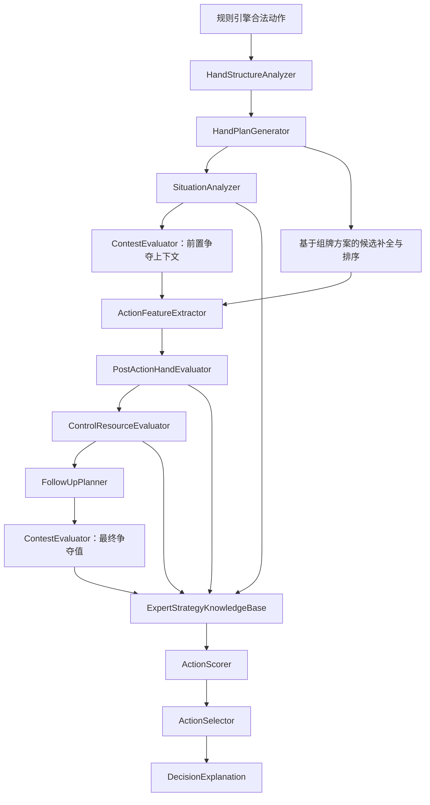
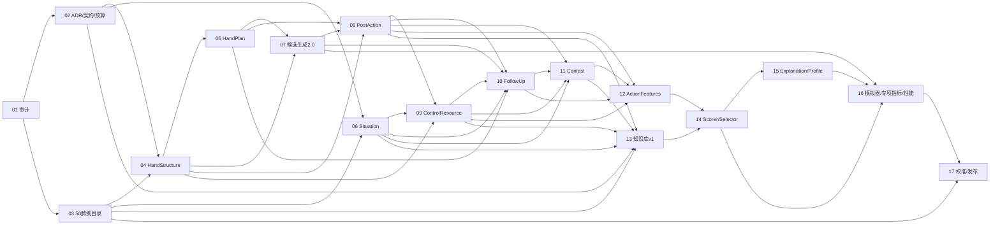

# P2.5 实施计划：整手规划驱动的专家启发式机器人

> 历史归档，已于 2026-07-22 撤销。本文仅保留原始计划证据，不是可执行计划。

> 历史归档：2026-07-22 已撤销。本文件保留原设计，不是可启动计划；现行状态见 `tasks.md`。
>
> 设计依据：[`docs/Guandan_Expert_Bot_Design_Specification_v1.0.md`](../../../docs/Guandan_Expert_Bot_Design_Specification_v1.0.md) 是 P2.5 最高级设计依据；本计划负责把其长期目标拆成可交付、可测试、可回滚的小阶段。现有规则引擎边界、`BotView` 信息公平、可注册策略库、可解释评分和确定性设计继续有效。

## 1. 修订原因与差距分析

原计划从局面特征直接进入单动作特征和评分，仍以“当前动作是否便宜”为中心。试玩暴露的问题说明机器人必须先理解整手牌的可行组牌方案，再评估候选动作执行后的余牌质量、控制资源和下一手路线。

| 试玩问题                                    | 当前机制/原计划缺口                                    | 新负责组件                                                              |
| ------------------------------------------- | ------------------------------------------------------ | ----------------------------------------------------------------------- |
| 有自然对 J/Q，却用红桃级牌与 6 组成更低对子 | 只惩罚低配，没有比较天然组合与逢人配机会成本           | `HandStructureAnalyzer`、`HandPlanGenerator`、`PostActionHandEvaluator` |
| 有天然 8888，却用两张逢人配与 55 制造 5555  | 不区分天然炸弹与逢人配炸弹，也没有整手方案价值         | `HandStructureAnalyzer`、`ControlResourceEvaluator`、专家规则           |
| 为压单 5 拆天然 8888 出 8                   | 组合破坏只按局部同点数组计罚，没有动作后重组与例外门控 | `PostActionHandEvaluator`、组合破坏规则                                 |
| 对手可压时机械争夺                          | pass 使用固定极高惩罚，没有争夺价值计算                | `ContestEvaluator`                                                      |
| 过早消耗王、级牌、A、高对子                 | 没有控制牌预算、最后控制资源或残局例外                 | `ControlResourceEvaluator`                                              |
| 最终留下大量 2–7 低散牌且无回收牌           | 没有整手分组、低散单/回收能力和死手风险                | `HandPlanGenerator`、`PostActionHandEvaluator`                          |
| 只看当前动作，不看压住后做什么              | “保持控制”只是单项分数，没有至少一手前看               | `FollowUpPlanner`                                                       |

候选生成和模拟器也存在基础缺口：当前领出候选未覆盖三连对、钢板、合理逢人配组合、同花顺和四王炸；自动对局只生成单张且每回合传入空公开事件。因此，候选生成修复和模拟器修复必须成为独立任务，不能留到调参阶段。

### 1.1 设计规范逐项差距摘要

| 规范能力                      | 当前方案状态                               | 本次修订                                                                                      |
| ----------------------------- | ------------------------------------------ | --------------------------------------------------------------------------------------------- |
| 完整决策链与职责边界          | 已覆盖，但 `ContestEvaluator` 存在顺序依赖 | 保留两阶段 contest context/final evaluation，禁止塞回巨型评分函数                             |
| 手牌结构来源                  | 弱化                                       | 补 `natural`、`wildcard_completed`、`split_from_existing_group`，并补四王炸、逢人配顺子、三张 |
| 多类整手方案                  | 弱化                                       | 明确最佳结构、最少手数、保守控制、助攻配合四类方案和 role fit                                 |
| 动作后整手评价与 DeadHandRisk | 已覆盖主体                                 | 补齐完整结构快照、七类死手信号和动作前后差值契约                                              |
| 控制资源预算                  | 部分覆盖                                   | 补高三张、同花顺、至少一个回收点和最后控制资源例外                                            |
| 争牌与后续路线                | 已覆盖主体                                 | 固化可合理过牌、至少前看一手和 `noUsefulFollowUp`                                             |
| 策略库规模                    | 首版仅 20—30 条，不足                      | P2.5A 调整为 30—40 条核心反愚蠢规则，P2.5B/C 增量扩展                                         |
| 固定专家牌例                  | 首批 50 例                                 | 保留 P2.5A 50 例发布门槛，P2.5B/C 分两批补至长期 100 例                                       |
| 自动对局指标                  | 仅 8 项错误指标                            | 增至 9 项，并保留头游率、双上率、合法性和决策耗时                                             |
| 性能与缓存                    | 只有 p95，缺部分优化边界                   | 对齐平均值 + p95；补增量重算、确定性早停、调试隔离和 Web Worker 启用条件                      |

现有 ADR-0008、ADR-0009、ADR-0014 分别继续作为信息边界、基础机器人/tie-break 和公开观察模型的历史依据。P2.5-02 新增扩展 ADR，不回写或静默改变已接受 ADR。

## 2. 修订后的架构图



逻辑顺序以用户要求的主链为准。`ContestEvaluator` 使用两阶段接口：前置阶段建立对手威胁、队友需要和“是否值得介入”的公共上下文；在动作后、控制资源与下一手结果产生后，再完成每个候选的最终争夺值。这样不形成循环依赖，也不会退回“有牌可压就争夺”的固定规则。

## 3. 保留的硬边界

- 规则合法性仍只由 `getLegalActions`、`validateAction`、`applyAction` 决定；策略不得自建牌型合法性副本。
- 机器人只读取自己的手牌、公开事件、各家公开余牌数、当前公开轮次状态和合法动作；不得读取对手手牌、牌堆或 seed。
- 相同 `BotView + StrategyProfile + 规则/权重版本` 必须产生相同候选、组牌方案、评分、解释与最终动作。
- 策略规则继续采用独立模块、注册表和 profile；新增策略不得要求重写评分主流程。
- 决策解释是派生诊断数据，不进入 `TurnState`、事件流、快照或存档。

## 4. 新增分析器与输出契约

### 4.1 HandStructureAnalyzer

对己方完整手牌做无副作用分析，至少输出：

- 天然炸弹与逢人配炸弹，保留每张实体牌 ID 和逢人配解释；
- 天然对子与逢人配对子；
- 四王炸、同花顺、自然/逢人配顺子、三连对、钢板、三带二、三张；
- 散单、2–7 低散单、弱对子；
- 王、级牌、红桃级牌、A、高对子、高三张、炸弹、同花顺等控制资源；
- 可用于重新获得牌权的回收牌。

每个可能组合标注 `natural`、`wildcard_completed` 或 `split_from_existing_group` 来源。同一实体牌可以出现在多个“可能组合”中，但必须区分候选组合与已选组牌方案，不能重复计算为同时持有的资源。

### 4.2 HandPlanGenerator

从全部可能组合中生成若干确定性的高质量整手分组方案，而不是只找一个贪心结果。每个 `HandPlan` 至少包含：

- 预计总手数；
- 结构完整度 `structuralIntegrity`；
- 天然炸弹数量；
- 逢人配占用张数及用途；
- 低散单数量、弱对子数量；
- 控制牌数量与分层；
- 回收牌权能力；
- 出完难度 `finishability` 和死手风险 `deadHandRisk`；
- 稳定的 plan ID、分组明细和解释。

至少生成四类计划候选：最佳结构、最少手数、保守控制、助攻配合，并输出主攻/助攻适配度。方案排序必须稳定。首版采用有界 top-K/束搜索，不做全局穷举；初始 Top-N 为 5—10，最终值在 P2.5-02 ADR 和性能基准中冻结。

### 4.3 SituationAnalyzer

继续负责公开局面：开/中/尾阶段、四家余牌、公开关键牌、出牌/过牌倾向、当前牌权、队友/对手威胁、主攻/助攻角色和置信度。阶段判断综合自己余牌、全桌余牌和是否有人进入冲刺，不得只看自己的余牌数；过牌只能形成带证据和置信度的概率倾向。所有推断必须标注来源与未知语义。

### 4.4 ContestEvaluator

删除“对手压住且有合法压制就必须争夺”的机械策略。前置阶段先生成不依赖具体动作的 `ContestContext`；后置阶段接收 `PostActionHandEvaluation`、`ControlResourceEvaluation` 和 `FollowUpPlan`，针对 play 与 pass 计算：

```text
contestValue = opponentThreat
             + partnerNeed
             + controlGain
             + followUpValue
             - structuralLoss
             - controlResourceCost
             - deadHandRiskIncrease
```

对手威胁低、压制成本高、压住后没有可行下一手时，pass 必须成为正常候选；对手仅剩 1 张、队友需要救援或当前动作可直接形成出完路线时，允许高成本例外。

### 4.5 ActionFeatureExtractor

负责动作本身和公开局面关系：张数、牌型、是否领出/跟牌、压谁、是否阻断、牌权变化、逢人配解释、命中哪个整手方案。它不再独自推断动作后手牌质量，而是引用后续专门评估器的输出。

### 4.6 PostActionHandEvaluator

对每个候选动作模拟移除己方实体牌后，重新运行手牌分析和有界组牌规划，至少输出：

- 动作前后预计总手数；
- 动作前后天然/逢人配炸弹与完整组合；
- 动作前后低散单、弱对子；
- 动作前后控制牌、回收牌；
- `structuralIntegrity`、`finishability`、`deadHandRisk` 的变化；
- 被破坏组合、产生的新死张和可接受例外。

所有“拆牌惩罚”必须来源于明确的前后差值，不能只看当前动作牌面。

### 4.7 ControlResourceEvaluator

识别并预算大小王、普通级牌、红桃级牌、A、高对子、高三张、天然/逢人配炸弹、同花顺等控制资源。至少惩罚：

- 手牌仍多时提前耗尽控制资源；
- 有多个低散单却不保留回收牌；
- 为低威胁牌局消耗最后一张控制牌；
- 使用红桃级牌制造已有天然替代的低价值组合。

尾局直接出完、阻止高威胁对手、救援即将出完的队友时可例外；例外必须进入解释。

### 4.8 FollowUpPlanner

至少前看一手。对“压住后我获得领出权”的候选，给出：

- 下一手准备出的牌型和实体牌；
- 是否继续减少预计总手数；
- 是否保留或再次取得控制；
- 是否形成连续出完路线；
- 若没有合理下一手，明确输出 `noUsefulFollowUp`。

首版只搜索自己下一手，不采样对手隐藏牌，也不做蒙特卡洛模拟。下一手候选同样来自规则引擎和高质量组牌方案。

## 5. 逢人配、控制资源与组合破坏规则

### 5.1 逢人配机会成本

- 有自然对子可合法压制时，不用逢人配组成更低对子。
- 有天然炸弹时，不用逢人配制造更小炸弹。
- 普通局面不使用两张逢人配制造低价值四炸。
- 每使用一张逢人配都计算其从其他高价值组牌方案中退出的机会成本。
- 尾局直接出完、阻止对手即将出完或显著改善整手出完路线时允许例外。

逢人配不是“固定高惩罚牌”；其代价取决于动作前后最佳组牌方案差值、剩余逢人配数量、局面阶段和威胁等级。

### 5.2 组合破坏等级

| 破坏类型                  | 普通局面基线   | 允许例外                                    |
| ------------------------- | -------------- | ------------------------------------------- |
| 拆天然炸弹                | 接近软禁止     | 直接出完；阻止仅剩 1 张对手；唯一高价值救援 |
| 拆同花顺/逢人配高价值炸弹 | 极高惩罚       | 与上相同，且动作后整体计划必须更优          |
| 拆钢板/三连对/自然顺子    | 高惩罚         | 显著减少总手数或形成明确连续路线            |
| 拆三带二                  | 中高惩罚       | 附属牌可重组且动作后死手风险不增加          |
| 拆天然对子                | 中等惩罚       | 对子为弱对子，或拆后解决低散单/直接出完     |
| 逢人配补低价值牌型        | 按机会成本惩罚 | 高威胁阻断或出完路线                        |

“软禁止”表示评分上极难被普通候选击败，但仍保留明确、可测试的残局和阻断例外；它不是绕过规则引擎的硬非法判定。

## 6. 候选生成修订

候选生成分成两层：

1. 规则覆盖层：保证可生成三连对、钢板、自然/合理逢人配组合、同花顺、普通炸弹和四王炸，并全部交给规则引擎验证。
2. 策略候选层：优先从 top-K `HandPlan` 中提取保持完整组合、减少总手数和保留控制资源的候选，再补充必要的压制、阻断和规则覆盖候选。

不得对 27 张手牌无界枚举所有子集。跟牌时按目标牌型/张数、牌型识别索引和组牌方案生成；所有去重键、截断排序和候选上限必须确定性。

自动对局必须复用与牌桌一致的候选生成入口，逐动作累计真实 `action.applied` 公开事件，不得继续传入空 `publicEvents`。

## 7. 可扩展策略库与评分

`ExpertStrategyRule`、`StrategyRegistry` 和 `StrategyProfile` 继续保留。规则只读取统一的 `DecisionContext`：

- `HandStructureAnalysis` 与 top-K `HandPlan`；
- `SituationFeatures` 与 `ContestEvaluation`；
- `ActionFeatures` 与 `PostActionHandEvaluation`；
- `ControlResourceEvaluation` 与 `FollowUpPlan`。

策略规则使用两个正交元数据，不能把“证据不足”和“实验开关”混成一个字段：

```ts
type StrategyEvidence =
  "rules_based" | "expert_source" | "heuristic" | "needs_expert_validation";

type StrategyMaturity = "default_eligible" | "experimental";
```

- `evidence` 表示规则依据和可信度，必须进入 `DecisionExplanation`。
- `maturity` 表示发布资格；`experimental` 只能进入实验 profile。
- `needs_expert_validation + default_eligible` 允许进入默认专家 profile，但必须同时满足：明确牌理解释；至少一个固定牌例；命中、未命中和例外测试；不与冻结规则冲突；自动对局/回归无明显异常；可由 profile 单独关闭；解释中显示证据等级。
- 默认 `expert` profile、实验 `experimental` profile 和回归 `normal` profile 分开版本化；规则升级不得静默改变旧 profile 快照。

评分器采用可解释分项：

```text
finalScore = immediatePlayValue
           + postActionStructureValue
           + finishabilityValue
           + contestValue
           + controlBudgetValue
           + followUpValue
           + teamworkValue
           + memoryValue
           + expertRuleAdjustment
           - wildcardOpportunityCost
           - combinationDestructionPenalty
           - deadHandRiskPenalty
```

所有分项、规则命中、例外和使用的 hand plan/follow-up plan 都进入 `DecisionExplanation`。同分仍使用稳定 tie-break。

## 8. 修订后的任务依赖关系



详细状态和逐项验收见 [tasks.md](tasks.md)。原 P2.5-03 至 P2.5-06 不直接沿用，已拆为独立可验收任务。

### 8.1 分阶段交付边界

| 范围                        | 定位                                   | 必须交付                                                                                       | 发布含义                                                                |
| --------------------------- | -------------------------------------- | ---------------------------------------------------------------------------------------------- | ----------------------------------------------------------------------- |
| **P2.5A（本次 P2.5 必须）** | 消除严重反人类牌感行为，建立可扩展骨架 | P2.5-01—17；完整分析链；30—40 条核心反愚蠢规则；S01—S50；9 项错误指标；10,000 局；profile 回滚 | 可发布“专家启发式机器人首版”，但不得宣称已完成规范全部 100 例和全部策略 |
| **P2.5B（后续增量）**       | 加深组牌与控制策略                     | 组牌/控制规则包扩展；S51—S75；缓存与增量重算优化；必要时 worker 原型                           | 独立 profile/version，可单独回滚                                        |
| **P2.5C（后续增量）**       | 加深协作、阻断与公开记牌               | 协作/阻断/记牌规则包扩展；S76—S100；完成规范八类牌例配额和全量调权                             | 达到 v1.0 规范的 100 例长期基线                                         |
| **后续 Bot-AI**             | 独立机器人能力路线                     | 增强记牌、伙伴意图及未来研究能力使用独立 Bot-AI 版本；仍受项目规则和信息边界约束               | 不与项目 P3 多人服务端编号混用                                          |

规范第 26 章中的后续阶段名称不覆盖项目既有 P3（权威服务端/多人房间）路线。已确认独立编号：

| Bot-AI 版本 | 能力定位           | 与当前阶段关系                               |
| ----------- | ------------------ | -------------------------------------------- |
| Bot-AI 2.0  | 专家启发式         | P2.5A/B 核心交付                             |
| Bot-AI 2.1  | 增强公开记牌       | P2.5C 增量交付                               |
| Bot-AI 2.2  | 队友意图           | P2.5C 增量交付                               |
| Bot-AI 3.0  | 隐藏信息采样       | 未来研究；必须另立 ADR，不得读取真实隐藏手牌 |
| Bot-AI 4.0  | 蒙特卡洛或有限搜索 | 未来研究；不属于 P2.5                        |
| Bot-AI 5.0  | 离线强化学习       | 未来研究；不属于 P2.5                        |

## 9. 固定牌例与自动对局专项指标

P2.5A 固定专家牌例门槛原为 50 个；对应目录已随撤销从工作树移除，仅能在 Git 历史中追溯。每例原本包含完整己方手牌、公开局面、合法候选、推荐/拒绝动作、允许备选、期望分析特征和解释断言。30—40 条规则只是规模门槛，不能替代覆盖门槛：天然对子优先、天然炸弹保护、逢人配机会成本、不无意义拆炸、控制牌保留、DeadHandRisk、合理过牌、后续路线和尾局例外必须全部进入阻断发布的固定牌例。

自动对局除胜率和合法性外，至少统计：

| 指标                     | 建议定义                                                                   |
| ------------------------ | -------------------------------------------------------------------------- |
| 无必要拆天然炸弹率       | 存在不拆炸弹的合理合法替代时，仍拆天然炸弹的动作数 / 对应机会数            |
| 逢人配低价值使用率       | 逢人配用于低对子/低炸弹且没有出完或高威胁阻断收益的动作数 / 逢人配使用数   |
| 有自然炸弹仍制造小炸弹率 | 手中保有天然炸弹时，另用逢人配制造更小炸弹的次数 / 对应机会数              |
| 手牌较多时控制牌耗尽率   | 自己余牌超过阶段阈值且动作后控制资源为零的次数 / 对应控制牌使用机会数      |
| 动作后低散单增加率       | 动作后 2–7 低散单数增加的动作数 / 非直接出完动作数                         |
| 高成本无意义压制率       | 对手威胁低、结构/资源成本高且无有用后续仍选择压制的次数 / 可过牌争夺机会数 |
| 高死手风险形成率         | 动作后 `deadHandRisk` 跨过高风险阈值的次数 / 非直接出完动作数              |
| 队友压住时无意义接牌率   | 队友已压住且无高威胁接管理由时仍接牌的次数 / 可合法让牌机会数              |
| 尾盘阻断成功率           | 面对高威胁对手时成功延迟其出完的次数 / 可合法阻断机会数                    |

同时记录本队头游率、双上率、合法动作率、完成率和平均/P95 决策耗时。P2.5-02 先冻结指标口径；P2.5-16 在固定 seed 基线上记录普通机器人现状，再由 P2.5-17 预先写定专家版阈值。已知严重牌例必须零失败，不能只靠总体胜率掩盖。

## 10. 分档性能预算与缓存方案

性能统计只计算策略 CPU 时间，不含 0.8–1.34 秒的人机可见思考延迟。建议初始预算如下，最终由 ADR 在固定硬件和移动样本上冻结：

| 难度             | 分析范围                                           | 初始预算门槛                           |
| ---------------- | -------------------------------------------------- | -------------------------------------- |
| 基础机器人       | 现有局部规则，无整手多方案规划                     | 平均 ≤10ms；P95 由 ADR 基线冻结        |
| 普通机器人       | 轻量结构分析、单个主计划、有限动作后检查           | 平均 ≤30ms；建议 P95 ≤75ms             |
| 专家启发式机器人 | top-N 整手方案、高质量候选动作后评估、至少一手前看 | 平均 ≤100ms；桌面与移动共同 P95 ≤250ms |

为保持确定性，生产决策不得按墙钟时间随机中断搜索。控制成本采用固定工作量：

- `DecisionFingerprint`：排序后的己方实体牌 ID、级牌、公开事件序号、余牌数、当前最高牌、profile/规则版本；
- `HandStructureCache`：按手牌指纹与级牌缓存结构分析；
- `HandPlanCache`：按结构指纹与 profile 缓存 top-K 方案；
- `PostActionCache`：按手牌指纹、动作 ID 与 profile 缓存动作后分析；
- `FollowUpCache`：按动作后手牌指纹与领出状态缓存下一手方案；
- 动作后增量重算：复用动作前结构索引，只使受已出实体牌影响的组合失效，再以冷计算对照测试保证等价；
- 明显劣质动作早停：仅在确定性的分数上/下界已证明候选不可能胜出时剪枝，并记录剪枝理由；不得按墙钟超时早停；
- 调试与生产分离：关闭解释详情时省略文本拼装和完整候选快照，但候选、分数和最终动作必须完全一致；
- 同一决策周期共享缓存，跨回合缓存只允许使用完整版本化指纹并设置容量上限；
- Top-N、候选束宽、下一手候选上限均使用稳定排序和固定上限；建议起始值为专家 hand plans 8、每动作后 plans 5、follow-up 候选 10，基准后再冻结；
- Web Worker：仅当真实移动样本出现主线程卡顿或专家 P95 超预算时启用；输入必须是可序列化 `BotView`/profile 快照，输出带决策指纹，过期结果丢弃，且同步/worker 路径必须产生相同决策。

若性能不达标，应优化索引、复用分析和收窄确定性束宽，而不是恢复机械争夺、跳过动作后评估或用运行时超时导致非确定性结果。

## 11. 受影响文件清单

本次计划修订实际修改：

- `proj-info/phases/P2.5/implementation-plan.md`
- `proj-info/phases/P2.5/tasks.md`
- `proj-info/phases/P2.5/test-matrix.md`
- `proj-info/phases/P2.5/README.md`
- 专家牌例目录已随撤销从工作树移除，仅保留 Git 历史。
- `proj-info/phases/P2.5/release.md`
- `proj-info/phases/P1-P3-execution-plan.md`
- `docs/基础机器人策略说明_V2.md`

未来实施预计影响但本次不修改：

- `frontend/src/games/guandan/strategy/`（新增策略子系统）
- `frontend/src/games/guandan/table-controller.ts`
- `frontend/src/games/guandan/simulation.ts`
- `frontend/src/games/guandan/bot-benchmark.ts`
- 对应的 analyzer、候选、评分、牌例、模拟器和组件测试文件

本计划曾经获得用户确认，但已于 2026-07-22 撤销；不得再将 P2.5-01 标记为 `in_progress`。

## 12. 已确认的设计决策

1. 采用 P2.5A/B/C 三段交付：A 为 30—40 条核心规则、50 例和可独立发布版本；B 深化整手/动作后/控制/后续路线；C 完善公开记牌、协作、对手倾向并达到 100 例。
2. P2.5A 的规则验收以已知严重错误覆盖为硬门槛，不能用规则数量或总体胜率替代。
3. P2.5A 验收发布后，牌桌机器人和“提示”默认共用 `expert` profile 和同一决策链；`normal` profile 保留作回归、对照和调试。
4. 专家性能预算为平均 ≤100ms、P95 ≤250ms；依次优化缓存、Top-N、增量计算和确定性早停，只有主线程卡顿、移动端掉帧或 P95 超标才引入 Web Worker。
5. 机器人能力采用 Bot-AI 2.0—5.0 独立编号，不占用项目既有 P3 及后续产品阶段编号。
6. `needs_expert_validation` 可进入默认专家 profile，但必须通过全部默认资格门禁；`experimental` 是独立成熟度状态，只能进入实验 profile。

以上决策是 P2.5 历史 ADR 的输入。P2.5-01—17 及 P2.5B/C 均为 `revoked`；恢复必须先经过新的 ADR 和独立验收。
