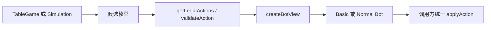

# P2.5-01 决策流、候选与模拟器审计基线

> 状态：`accepted`（2026-07-16）。本文件只固化 P2.5A 改造前的可复现事实、测试和性能数据；不改变规则引擎、候选生成或机器人出牌行为。

## 结论

规则合法性和信息公平边界正确：`getLegalActions()` 通过 `validateAction()` 过滤，机器人只能从 `BotView.legalActions` 选择；`BotView` 不含对手手牌或 seed（ADR-0008）。牌桌机器人与提示也共用 `chooseNormalBotAction()`。

问题在策略输入和评价粒度：现有机器人把非队友压住时的 `pass` 固定重罚；只做局部同点数组惩罚；不计算逢人配机会成本、整手组牌、动作后余牌、控制牌预算、DeadHandRisk 和下一手路线。牌桌候选不完整，模拟器更只生成单张并始终传入空公开事件。

## 实际决策链



| 环节     | 实际代码                                                                   | 已有边界                      | 缺口                                                                   |
| -------- | -------------------------------------------------------------------------- | ----------------------------- | ---------------------------------------------------------------------- |
| 牌桌候选 | `table-controller.ts:leadingCardCandidates`、`botCardCandidates`           | 规则引擎最终过滤              | 领出未完整覆盖三连对、钢板、逢人配、同花顺、四王炸                     |
| 模拟候选 | `simulation.ts:candidateActions`                                           | 单张和合法过牌                | 仅查 `singlePatternsByCardId`，没有任何多张候选                        |
| 策略     | `basic-bot.ts:chooseBasicBotAction`、`normal-bot.ts:chooseNormalBotAction` | 稳定 JSON tie-break；对家让牌 | 没有独立分析器/计划/动作后评分链                                       |
| 公开事件 | 牌桌 `chooseTableStrategicAction`                                          | 传入 `game.publicEvents`      | 模拟器 `botAction` 每回合写死 `publicEvents: []`；现有评分也未消费事件 |
| 执行     | `turns.ts:applyAction`                                                     | 统一规则状态机                | 正确，P2.5 不得绕过                                                    |

## 策略缺口的函数级证据

### 机械争夺

- `basic-bot.ts:chooseBasicBotAction` 将非对家最高牌定义为 `mustContest`；`score()` 对该局面的 `pass` 返回 `1_000_000`。
- `normal-bot.ts:chooseNormalBotAction` 对非队友最高牌的 `pass` 固定加 `1_000`，解释为“对手领出时优先压制”。
- `basic-bot.test.ts` 现有测试“对手压住且存在合法压制时必须接牌”确认这正是当前行为。

当前没有对手威胁、结构损失、资源成本或压住后路线比较。P2.5-03 先固定“低威胁、高成本、无路线时可过牌”的失败牌例；P2.5-11 才替换这一机制。

### 逢人配、组合与控制资源

- `basic-bot.ts:wildcardDownrankPenalty` 只处罚红桃级牌在非残局被指定为较低点数（固定 `10_000`）。它不比较天然对 J/Q 与逢人配对 6，也不记录一张/两张逢人配的替代用途或天然/逢人配炸弹区别。
- `basic-bot.ts:splitGroupPenalty` 只按同点数拆对子/三张；没有天然炸弹、钢板、三连对、三带二、同花顺的来源或拆分代价。
- `normal-bot.ts:structuralBreakPenalty` 只处罚拆小王对子和“有王时拆五张自然顺子”的单张；不覆盖天然 8888。
- `basic-bot.ts:hasRequiredRecovery` 是领出时的高牌/高对子布尔启发式，不是控制牌预算，也不会计算低散单、预计手数或 DeadHandRisk。
- 两条策略都不在移除候选实体牌后重新分析，也不前看下一手。

## 候选生成审计

`leadingCardCandidates()` 只拼接单张、完整同点组、三张加对子组成的三带二和“每点数窗口各取第一张”的自然五张顺子。其后才由 `recognizePatterns()` 与 `getLegalActions()` 过滤。

| 牌型                       | 领出                     | 跟牌                           | 结论                                      |
| -------------------------- | ------------------------ | ------------------------------ | ----------------------------------------- |
| 单张、对子、三张、天然炸弹 | 有限覆盖                 | 同张数子集，另加完整天然炸弹   | 有现存测试                                |
| 三带二                     | 仅恰好三张组加恰好对子组 | 同张数子集可能碰到             | 不保证逢人配或多组选择                    |
| 顺子                       | 每五点窗口的首张组合     | 同张数子集                     | 不枚举逢人配；多副/花色选择受输入顺序影响 |
| 三连对、钢板               | 缺失                     | 子集枚举可能碰到但不按牌型构造 | 领出不会组合多个对子或三张                |
| 同花顺                     | 不完整                   | 不完整                         | 自然顺子偶然同花时可出现，但不按花色枚举  |
| 四王炸                     | 缺失                     | 缺失                           | 小王/大王被分在不同点数组，从未组合       |
| 含逢人配组合               | 缺失                     | 只会偶然出现在已有子集         | 没有按红桃级牌解释空间生成                |

复现方式：构造 `TableGame`，调用公开导出 `getLegalBotActions(game)`；用 `recognizePatterns()` 证明目标牌型在规则层合法、却不在候选集中。P2.5-03 必须将每种“规则合法但候选缺失”写为 fixture，P2.5-07 才修复。

## 模拟器审计

`simulation.ts:createInitialTurnState()` 预计算 `singlePatternsByCardId`；`candidateActions()` 只将每张牌包装成 `[cardId]` 的 `play`，再加入过牌。因此 10,000 局自动对局不能代表实际牌桌的多张候选、逢人配、组牌或拆牌表现。

`simulation.ts:botAction()` 每一回合调用 `createBotView()` 时固定使用 `publicEvents: []`，没有累积已经公开的 play/pass。这使后续 SituationAnalyzer 和公开记牌指标无法得到可信模拟数据。

## 真实测试与性能样本

环境：Windows 本地工作区；数据只作本机审计样本，不能作为 P2.5A 最终性能阈值。受限沙箱中 Vite 写入 `node_modules/.vite-temp` 会出现 `EPERM`，下列 Vitest 在受控执行环境运行。

| 命令                                                                                                                                                                                     | 结果 | 实测数据                                                                                                                          |
| ---------------------------------------------------------------------------------------------------------------------------------------------------------------------------------------- | ---- | --------------------------------------------------------------------------------------------------------------------------------- |
| `npm.cmd run test:run -- --run src/games/guandan/basic-bot.test.ts src/games/guandan/normal-bot.test.ts src/games/guandan/table-controller.test.ts src/games/guandan/simulation.test.ts` | 通过 | 4 files / 29 tests；Vitest tests 10.47s；其中 1,000 局模拟 10.281s                                                                |
| `npx.cmd vitest run --configLoader runner src/games/guandan/bot-benchmark.10k.test.ts -t "分批基准 1"`                                                                                   | 通过 | 2,500 局全部完成；normal 胜率 0.5472；平均动作数 205.5016；平均决策字段 0.062083825138101116ms；最大字段 106.9868ms；测试 31.900s |

测量限制：`bot-benchmark.ts` 的 `maxDecisionMs` 实际计时的是“一整局 `runSimulation`”，不是单次决策 P95；`averageDecisionMs` 也是整批耗时除以总动作数，包含模拟/候选/规则开销。当前无冷暖缓存、P95、候选数、计划数或公开事件长度采样。P2.5-02 冻结统计口径，P2.5-16 实现。

## P2.5-02 的输入清单

1. 保留 ADR-0008 的信息边界、`getLegalActions`/`validateAction` 的唯一合法性边界和稳定排序。
2. 分别定义 `HandStructureAnalyzer`、`HandPlanGenerator`、`SituationAnalyzer`、动作后、控制、争夺和后续路线模块的只读输入/独立输出；不得读取对手手牌。
3. 定义天然、逢人配完成和从既有组合拆出的实体牌归属，不能复用同点数猜测。
4. 冻结候选、计划、动作后和路线的稳定上限/fingerprint；禁止按墙钟超时改变选择。
5. 冻结基础/普通/专家三档的单动作时长、P95、候选数、Top-N、冷暖缓存和早停原因。
6. 冻结公开事件的最小投影、序号及模拟器累计方式；决策解释不得进入事件流或存档。
7. 冻结 `normal`/`expert`/`experimental` 和 `evidence`/`maturity` 的隔离、持久化和回滚边界。

## P2.5-03 的输入清单

1. S01/S02：有天然对 J/Q 时拒绝红桃级牌 + 6 的对 6；S03：有 8888 时拒绝两张逢人配组成 5555。
2. S11：普通局面拒绝拆 8888 的单 8 压单 5；S12：对手只剩一张时允许可解释的阻断例外。
3. 控制牌预算：手牌仍多且低散单多时，拒绝为低威胁动作耗尽最后控制资源。
4. 争夺价值：固定低威胁高成本可过，以及高威胁/有路线应争的成对场景。
5. 三连对、钢板、逢人配合理组合、同花顺、四王炸：均有“规则合法且当前候选是否存在”的基线断言。
6. 模拟器公开事件：至少两个回合 play/pass 后，下一次 `BotView.publicEvents` 的长度、顺序和内容可断言；先失败，P2.5-16 修复。

## 验收边界与建议命令

本任务未新增 ADR、fixture schema、分析器、候选生成 2.0、模拟器修复、评分或策略规则。当前 2,500 局样本因模拟器只出单张，不能证明策略质量或专家档性能，不能据此宣布 P2.5A 达标。

```powershell
Push-Location frontend
npm.cmd run format:check
npm.cmd run typecheck
npm.cmd run lint
npm.cmd run test:run -- --run src/games/guandan/basic-bot.test.ts src/games/guandan/normal-bot.test.ts src/games/guandan/table-controller.test.ts src/games/guandan/simulation.test.ts
npx.cmd vitest run --configLoader runner src/games/guandan/bot-benchmark.10k.test.ts -t "分批基准 1"
Pop-Location
git diff --check
```
